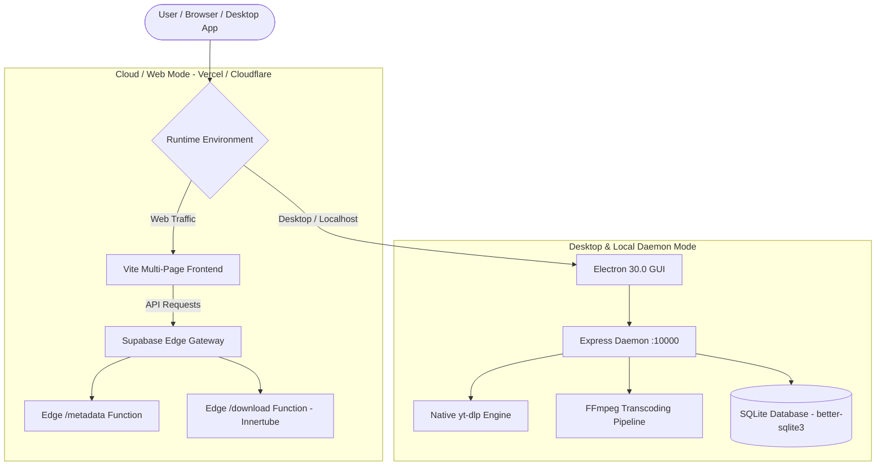

# Product Requirements Document (PRD)
## StreamVault PRO — 4K All-in-One Social Video Downloader & Media Suite

---

## 1. Executive Summary & Vision

**StreamVault PRO** is a professional-grade, dual-architecture media downloader, converter, and audio extraction platform. It bridges the gap between high-speed zero-install web tools and unrestricted, hardware-accelerated desktop download engines.

* **Product Name:** StreamVault PRO
* **Product Version:** 1.0.0 (Production Dual-Engine)
* **Tagline:** Ultra-Fast 4K Social Video Downloader & Media Converter
* **Repository:** [StreamVault-PRO](https://github.com/DeepakRochani/StreamVault-PRO)

---

## 2. Product Architecture: The Dual-Engine Model

StreamVault PRO operates seamlessly in two distinct runtime modes:



### Mode Comparison Matrix

| Feature | Cloud / Web Mode (Vercel / Cloudflare) | Desktop / Daemon Mode (Electron / Local) |
| :--- | :--- | :--- |
| **Installation** | Zero install (Browser access) | Desktop installer (`.exe` / `.dmg` / `.app`) |
| **Max Resolution** | 1080p Full HD (Cloud Streams) | **4K (2160p) 60fps & 8K (4320p)** |
| **YouTube Extraction** | `youtubei.js` (Innertube Serverless) | Native `yt-dlp` + FFmpeg muxing |
| **Restricted / Music Videos** | Enabled via `YOUTUBE_COOKIE` Secret | **100% Unrestricted** (Local browser cookies) |
| **Video Conversion** | Cloud CDN format streaming | Local FFmpeg hardware-accelerated transcoding |
| **Database & Auth** | Supabase PostgreSQL + Auth | Supabase Auth + Local SQLite backup |

---

## 3. Supported Platforms & Capabilities

### Supported Social Platforms
1. **YouTube & Shorts:**
   - 4K (2160p), 1440p (2K), 1080p 60fps, 720p, 480p, 360p.
   - High-fidelity MP3 / M4A audio extraction (up to 320 kbps).
   - Video duration, channel details, and max-res thumbnail previews.
2. **Instagram (Reels, Stories, Posts):**
   - Direct CDN extraction with zero watermarks.
3. **TikTok:**
   - High-definition video extraction without TikTok watermark overlay.
4. **Facebook & Twitter / X:**
   - Single and multi-resolution format parsing.

---

## 4. Complete Application Pages & Routing

| Page File | Route URL | Purpose & Capabilities |
| :--- | :--- | :--- |
| [`index.html`](file:///Users/drfilms/Documents/Steam%20vault%20pro/index.html) | `/` | Core video downloader interface, quality selector, and progress tracker. |
| [`streamvault-admin.html`](file:///Users/drfilms/Documents/Steam%20vault%20pro/streamvault-admin.html) | `/streamvault-admin` | Full administration portal (Users, Subscriptions, Feature Flags, Ads). |
| [`streamvault-admin-login.html`](file:///Users/drfilms/Documents/Steam%20vault%20pro/streamvault-admin-login.html) | `/streamvault-admin-login` | Secure JWT-based Super Admin authentication. |
| [`streamvault-converter.html`](file:///Users/drfilms/Documents/Steam%20vault%20pro/streamvault-converter.html) | `/streamvault-converter` | Media format converter (MP4, MP3, WAV, AAC, WebM, AVI, MOV). |
| [`download-queue.html`](file:///Users/drfilms/Documents/Steam%20vault%20pro/download-queue.html) | `/download-queue` | Batch downloading queue with real-time status and pause/resume. |
| [`streamvault-dashboard.html`](file:///Users/drfilms/Documents/Steam%20vault%20pro/streamvault-dashboard.html) | `/streamvault-dashboard` | User personal dashboard, saved downloads, and quota usage. |
| [`streamvault-billing.html`](file:///Users/drfilms/Documents/Steam%20vault%20pro/streamvault-billing.html) | `/streamvault-billing` | Plan comparison, subscription management, and payment checkout. |
| [`streamvault-upgrade.html`](file:///Users/drfilms/Documents/Steam%20vault%20pro/streamvault-upgrade.html) | `/streamvault-upgrade` | PRO plan feature highlights and upsell funnel. |
| [`streamvault-profile.html`](file:///Users/drfilms/Documents/Steam%20vault%20pro/streamvault-profile.html) | `/streamvault-profile` | User profile, security settings, and API keys. |
| [`streamvault-login.html`](file:///Users/drfilms/Documents/Steam%20vault%20pro/streamvault-login.html) | `/streamvault-login` | User sign-in, registration, and password recovery. |
| [`streamvault-legal.html`](file:///Users/drfilms/Documents/Steam%20vault%20pro/streamvault-legal.html) | `/streamvault-legal` | Terms of Service, Privacy Policy, DMCA, and Copyright notices. |
| [`diagnostics.html`](file:///Users/drfilms/Documents/Steam%20vault%20pro/diagnostics.html) | `/diagnostics` | Real-time system health, `yt-dlp` version, Python and FFmpeg checks. |

---

## 5. Admin Panel Specification

### Admin Credentials:
* **Email:** `admin@streamvault.com`
* **Password:** `streamvault2026`

### Admin Capabilities & Modules:
1. **Analytics & Performance:**
   - Real-time download counters, conversion rates, and bandwidth usage.
   - Platform breakdown charts (YouTube vs Instagram vs TikTok vs Facebook).
2. **User & Access Management:**
   - View, search, and filter registered users.
   - Assign user roles (`user`, `pro`, `admin`).
   - Ban accounts or trigger security password resets.
3. **Subscriptions & Monetization:**
   - Configure pricing tiers (*Free*, *Pro Monthly*, *Pro Annual*, *Lifetime Pass*).
   - Set download quotas, speed limits, and 4K permission gates.
4. **Feature Flags:**
   - Enable/disable maintenance mode, 4K downloading, or third-party proxies dynamically without rebuilding the app.
5. **Ad Management:**
   - Control Google AdSense slot IDs, interstitial frequency limits, and rewarded ad settings.
6. **Activity & Audit Logging:**
   - Detailed audit trails of server events, failed extraction attempts, and payment transactions.

---

## 6. Technical Stack & Dependencies

### Frontend:
* **Framework:** Vanilla JavaScript (ES6+), HTML5, CSS3
* **Build Tool:** Vite 6.4.3 (Ultra-fast multi-page static bundling)
* **Styling:** Modern Dark-Mode Glassmorphism Design System
* **Icons:** Google Material Symbols Outlined

### Backend (Local Daemon & Desktop):
* **Runtime:** Node.js (v18+) / Electron 30.0
* **Server:** Express 4.18.2
* **Extraction Engine:** `yt-dlp` (Auto-updating binary)
* **Transcoding:** `fluent-ffmpeg`, `@ffmpeg-installer`, `@ffprobe-installer`
* **Database:** `better-sqlite3` 12.10.0 + Supabase Client

### Backend (Cloud / Serverless):
* **Runtime:** Deno (Supabase Edge Functions)
* **Extraction Library:** `youtubei.js` (Innertube)
* **Edge Functions:** [`metadata`](file:///Users/drfilms/Documents/Steam%20vault%20pro/supabase/functions/metadata/index.ts), [`download`](file:///Users/drfilms/Documents/Steam%20vault%20pro/supabase/functions/download/index.ts)

### Payment Gateways:
* **Stripe:** Card payments, global currencies, recurring subscriptions.
* **Razorpay:** UPI, NetBanking, Cards for India/APAC region.
* **Apple In-App Purchases (IAP):** Mac App Store / iOS subscription engine.
* **Google Play Billing:** Android integration.

---

## 7. Deployment & Hosting Guide

### A. Vercel (Frontend & Web UI)
1. Import GitHub repository: `DeepakRochani/StreamVault-PRO`.
2. Build Settings:
   - **Framework:** `Vite`
   - **Build Command:** `npm run build`
   - **Output Directory:** `dist`
3. Configuration handled automatically by [`vercel.json`](file:///Users/drfilms/Documents/Steam%20vault%20pro/vercel.json).

### B. Cloudflare Pages
1. Connect Git repository in Cloudflare Dashboard.
2. Build Command: `npm run build` | Output: `dist`.
3. Routing & Security headers handled by [`public/_headers`](file:///Users/drfilms/Documents/Steam%20vault%20pro/public/_headers) and [`public/_redirects`](file:///Users/drfilms/Documents/Steam%20vault%20pro/public/_redirects).

### C. Supabase Edge Functions
```bash
# Deploy all Edge Functions
npx supabase functions deploy metadata --project-ref sjnamkshicpxtyikzsnp --no-verify-jwt
npx supabase functions deploy download --project-ref sjnamkshicpxtyikzsnp --no-verify-jwt
```

### D. Electron Desktop Builds
```bash
# Windows (.exe / installer)
npm run dist

# Run Desktop Dev Mode
npm run electron
```

---

## 8. Security & Legal Compliance
* **DMCA Notice:** StreamVault PRO complies with DMCA and terms for personal offline backup only.
* **Rate Limiting:** Express `express-rate-limit` prevents DDoS and scraper abuse.
* **Cookie Isolation:** Cookie decryption utilizes OS-level sandboxing (macOS TCC / Windows DPAPI).
* **CORS & Headers:** Strict Content Security Policy (CSP), `X-Frame-Options: SAMEORIGIN`, and `X-Content-Type-Options: nosniff` enabled.
