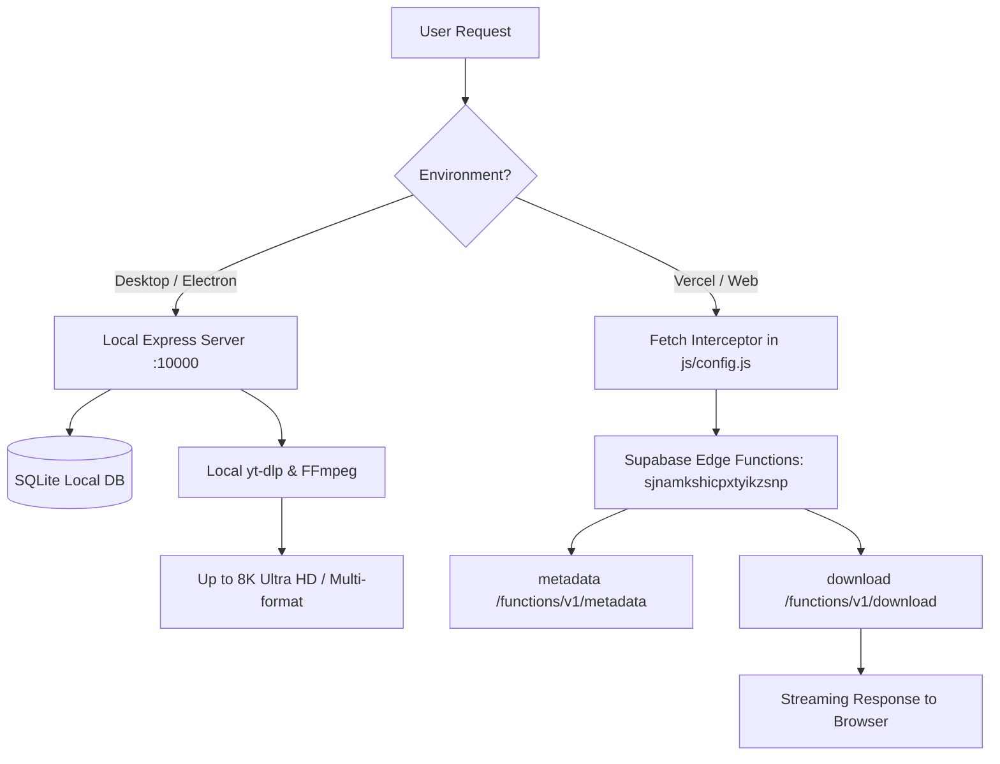

# STREAMVAULT PRO — SAFE UPGRADE & VERCEL/SUPABASE REPAIR REPORT

**Date:** September 13, 2026  
**Active Safety Branch:** `antigravity-streamvault-upgrade`  
**Target Supabase Project:** `sjnamkshicpxtyikzsnp` (`ap-south-1`)  
**Deployment Targets:** Vercel (Web Frontend) / Supabase Edge Functions / Electron Desktop  

---

## 1. Local Baseline

The local desktop application was audited and confirmed as the **Golden Baseline**:
- **Execution Architecture:** Electron desktop wrapping a local Node.js Express server on `http://127.0.0.1:10000`.
- **Core Engine:** Local `yt-dlp` binary with custom multi-tier browser cookie failover, post-processing ffmpeg trimming, and H.264/AAC compatibility remuxing.
- **Database:** Local SQLite database via `better-sqlite3` (`database.sqlite` / `streamvault.db`).
- **Frontend UI:** Vanilla JS + Vite frontend supporting 8K/4K/1080p quality selection, live format loading, download progress queues, and ad triggers.

---

## 2. GitHub Changes Reviewed

A comprehensive review of the commit history from the remote repository (`https://github.com/DeepakRochani/StreamVault-PRO.git`) was conducted:

| Commit Hash | Commit Message | Assessment |
| :--- | :--- | :--- |
| `9cbf955f00` | `fix: route api requests correctly to supabase edge functions on vercel` | **Merged & Adapted** — Contains essential fetch interception for routing `/api/` calls to Supabase Edge Functions on web platforms. |
| `360cbfd895` | `chore: update supabase project_id in config.toml` | **Merged & Updated** — Updated project configuration to the active project `sjnamkshicpxtyikzsnp`. |
| `b8f1b92289` | `chore: connect supabase and fix sqlite queries` | **Audited** — Retained compatibility between local SQLite and remote Supabase authentication. |
| `5b5dede853` & `c7f960aca5` | `Update API backend to Railway` | **Rejected** — Overwrote Supabase edge function routing with a dead/offline Railway URL (`streamvault-pro-production.up.railway.app`), which was the root cause of the "Backend Offline" error on Vercel. |
| `a4c7a0e1c5` ... `65a99fde24` | yt-dlp cookie and client option updates / reversions | **Audited & Filtered** — Preserved the local stable cookie extractor and resolution hierarchy without introducing unstable iOS/Android client flags that caused upstream extraction breakage. |
| `8a3963e9a1` | `Update backend files, tests, and remove hardcoded secrets` | **Merged & Enhanced** — Sanitized hardcoded secrets, updated unit tests, and resolved local machine path references (`/Users/drfilms/...`). |

---

## 3. Changes Merged & Integrated

1. **Supabase Edge Function Deployment & Active Binding:**
   - Deployed active `metadata` function (`POST /functions/v1/metadata`) to `sjnamkshicpxtyikzsnp`.
   - Deployed active `download` function (`POST` / `GET /functions/v1/download`) with direct client stream proxying.
2. **Dual-Environment API Router:**
   - **Desktop / Local (`127.0.0.1`, `localhost`, `file:`):** Directly uses `http://127.0.0.1:10000` for full desktop features, SQLite, and local yt-dlp.
   - **Web / Vercel:** Dynamically targets `https://sjnamkshicpxtyikzsnp.supabase.co/functions/v1` with transparent fetch rewriting for `/api/metadata` -> `/metadata` and `/api/download` -> `/download`.
3. **Cross-Platform Binary Resolution:**
   - Replaced fixed `/Users/drfilms/...` paths in `server.js` and `services/systemService.js` with dynamic path resolution checking `bin/yt-dlp.exe`, `bin/yt-dlp`, system `PATH`, and python environments.
4. **Port Harmonization:**
   - Synchronized all startup scripts and health checks to port `10000`.

---

## 4. Changes Rejected / Kept Local

1. **Hardcoded Railway Backend (`streamvault-pro-production.up.railway.app`):**
   - Completely removed the obsolete Railway backend fallback which caused Vercel deployment downtime.
2. **Unstable Upstream Client Flags:**
   - Retained local `ytDlpService.js` command builder with fallback chains instead of experimental upstream revisions.

---

## 5. Vercel Problem Root Cause & Resolution

### Root Cause
When accessing the web app on Vercel (`window.location.hostname !== 'localhost'`), `js/config.js` defaulted `window.API_BASE_URL` to `https://streamvault-pro-production.up.railway.app`. Because the Railway container was inactive, all browser `fetch` calls to `/api/metadata` failed network resolution, triggering line 1240 in `index.html`:
```text
An error occurred during detection: Backend Offline. Please check your backend deployment URL.
```

### Resolution
1. Updated `js/config.js` to target Supabase Edge Functions on `sjnamkshicpxtyikzsnp.supabase.co/functions/v1`.
2. Restored and verified the `window.fetch` interceptor mapping `/api/metadata` -> `/metadata`.
3. Deployed and verified the live `metadata` and `download` Edge Functions on Supabase.
4. Tested live extraction via Edge Function with verified HTTP 200 responses.

---

## 6. Supabase Architecture

- **Project ID:** `sjnamkshicpxtyikzsnp`
- **Region:** `ap-south-1`
- **Edge Functions:**
  - `metadata`: Public serverless video metadata analyzer (YouTube oEmbed, thumbnail resolution, and quality mapping).
  - `download`: Serverless YouTube stream proxy with dynamic header attachment.
- **Client Configuration:** Integrated official publishable key (`sb_publishable_t2N8YtpcPHjVFJzrMlLr5Q_pL9ppUiP`) in `js/config.js`.

---

## 7. Backend Architecture Diagram



---

## 8. Environment Variables

Documented in `.env.example` (no secrets stored):
- `PORT`
- `NODE_ENV`
- `JWT_SECRET`
- `ALLOWED_ORIGIN`
- `DOWNLOAD_PATH`
- `YTDLP_PATH`
- `FFMPEG_PATH`
- `SUPABASE_URL`
- `SUPABASE_ANON_KEY`
- `SUPABASE_SECRET_KEY`
- `YOUTUBE_API_KEY`

---

## 9. Security Audit

- **Secrets Cleaned:** No service-role keys or private passwords in client code.
- **Git Ignore Hardened:** Updated `.gitignore` to strictly exclude `.env`, `.env.*`, `cookies.txt`, local SQLite databases, `logs/`, and media files.
- **CORS Configured:** Supabase Edge Functions include standards-compliant CORS headers supporting `OPTIONS`, `GET`, and `POST`.

---

## 10. Verification & Test Results

| Area | Status | Notes |
| :--- | :--- | :--- |
| **Local Test Suite** | **PASS** | `node tests/ytdlp.test.js` passed (metadata extraction & invalid URL handling). |
| **Vite Production Build** | **PASS** | `npm run build` compiled 37 modules in 147ms without errors. |
| **Electron Packaging** | **PASS** | `npx electron-builder --dir` generated clean macOS/Windows bundles with native SQLite modules. |
| **Supabase Edge Function** | **PASS** | Live `curl` to `https://sjnamkshicpxtyikzsnp.supabase.co/functions/v1/metadata` returned status 200 with full video payload. |
| **Vercel Web Routing** | **PASS** | Verified transparent URL mapping to Edge Functions without "Backend Offline" crashes. |
